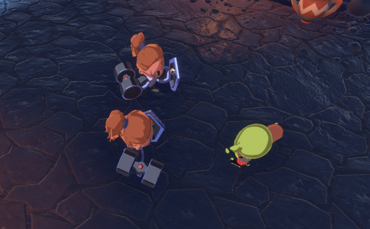

TODO examples to use in Boss Room


## Boss Room uses RPCs to send movement inputs.

``` csharp reference
https://github.com/Unity-Technologies/com.unity.multiplayer.samples.coop/blob/develop/Assets/BossRoom/Scripts/Client/Game/Character/ClientInputSender.cs
```

We want the full history of inputs sent, not just the latest value. There's no need for NetworkedVars, you just want to blast your inputs to the server. Since Boss Room is not a twitch shooter, we're sending inputs as reliable RPCs, we don't care about the additional latency an input loss would add. 
   
(TODO add link to future FPS article on managing inputs?)

## Sending action inputs RPCs

Sending from server to client RecvPerformHitReactionClient 

``` csharp reference        
https://github.com/Unity-Technologies/com.unity.multiplayer.samples.coop/blob/d09330434d864de384db0ce144aa30e5a20aeb3c/Assets/BossRoom/Scripts/Shared/Game/Entity/NetworkCharacterState.cs#L174
```

The "ouch" RPC mentioned for NetworkCharacterState in PR62 is interesting and worth mentioning for optimization purposes. You'd normally want to have only one RPC for the action and let the client decide who should play the "ouch" animation. Here, since this is a long running action over multiple frames, you don't know yet when sending the initial RPC which characters will be affected by that action. you want this to be dynamic as the boss is hitting targets. So multiple RPCs will be sent for each hit character.

## Arrow's GameObject vs Fireball's VFX

The archer's arrows uses a standalone GameObject that's then replicated over time. Since this object's movements are slow moving, we made the choice to use state to replicate this ability's status, in case a client connected while the arrow was flying. 

``` csharp reference
https://github.com/Unity-Technologies/com.unity.multiplayer.samples.coop/blob/develop/Assets/BossRoom/Scripts/Server/Game/Entity/ServerProjectileLogic.cs
```

We could have used an RPC instead, like for the Mage's projectile attack. In that case, since it's expected for that projectile to be quick, we don't mind the few milliseconds where a newly connected client could miss the projectile and we save on bandwidth having to manage a replicated object. Instead a single RPC is sent to trigger the FX client side.


``` csharp reference
https://github.com/Unity-Technologies/com.unity.multiplayer.samples.coop/blob/develop/Assets/BossRoom/Scripts/Server/Game/Action/FXProjectileTargetedAction.cs
```

## Breakable objects "broken" state

Breakable objects have a "broken" state that's using NetworkedVars. We could have used an RPC to trigger a "break" event, but then any new players connecting mid-game would need to receive that RPC. This means we would need to add code ourselves to manage those RPCs on new player connection. That's useless code that would disappear by using NetworkedVars directly.

``` csharp reference
https://github.com/Unity-Technologies/com.unity.multiplayer.samples.coop/blob/develop/Assets/BossRoom/Scripts/Shared/Game/Entity/NetworkSpawnerState.cs
```

## Character life state

We could have used a "kill" RPC to set a character as dead and play the appropriate animations. Applying our "should that information be replicated when a player joins the game mid-game" rule of thumb, we used NetworkedVars instead. We used the "OnValueChanged" callback on those values to play our state changes animation.

``` csharp reference
https://github.com/Unity-Technologies/com.unity.multiplayer.samples.coop/blob/5832b697a790595bc7d9afd3d5cc418c7318ccb8/Assets/BossRoom/Scripts/Shared/Game/Entity/NetworkCharacterState.cs#L63
```

The animation change:

``` csharp reference
https://github.com/Unity-Technologies/com.unity.multiplayer.samples.coop/blob/5832b697a790595bc7d9afd3d5cc418c7318ccb8/Assets/BossRoom/Scripts/Client/Game/Character/ClientCharacterVisualization.cs#L49
```
        
:::tip

Lesson learned: Error when connecting after imps have died. 

Here's a small gotcha we encountered while developing Boss Room. Using NetworkedVars is not magical. If you use OnValueChanged, you still need to make sure you're initializing your values when spawning for the first time. OnValueChanged won't be called when connecting for the first time, only for the subsequent value changes.


 

``` csharp reference
https://github.com/Unity-Technologies/com.unity.multiplayer.samples.coop/blob/develop/Assets/BossRoom/Scripts/Client/Game/Character/ClientCharacterVisualization.cs !       
```
PR to fix issue: https://github.com/Unity-Technologies/com.unity.multiplayer.samples.coop/pull/76

:::

## Position
        
All our replicated object's position is synced through NetworkedVars. If this was done through RPCs, this would mean we would need to keep a list of RPCs to send to connecting players, so they would get the latest position values for each objects. Keeping a list of RPCs for each objects so we could send those RPCs on connectiong would be a maintainability nightmare. We're letting the SDK do the work :)